# System Documentation & Setup Guide

DocuStream AI is a high-performance, single-document PDF conversational assistant built using **FastAPI**, **Microsoft SQL Server (Azure SQL Edge)**, **Qdrant Vector Database**, and **Server-Sent Events (SSE) Streaming**. 

It is designed to scan local directories recursively, track and deduplicate parsed text chunks in a relational database, generate semantic vector embeddings, and stream answers grounded strictly in the selected document. The system maintains a low CPU footprint (<50%) using background executors, batching, and highly optimized ONNX runtimes.

---

## 1. System Architecture

The following diagram illustrates the lifecycle of a document (Ingestion Flow) and the path of a query (Question Flow):

```mermaid
flowchart TB
    subgraph Ingestion Flow [1. Ingestion Flow]
        A[Local Folder /data OR Manual Upload] --> B[File System Scan]
        B --> C[Compute SHA256 Checksum]
        C --> D{Is File New or Modified?}
        D -- No --> E[Skip - Already Processed]
        D -- Yes --> F[Parse PDF pages via pypdf]
        F --> G[Sliding Window Chunking<br>500-800 tokens, 50-100 overlap]
        G --> H[Store Chunks Metadata in SQL Server<br>status=PENDING]
        H --> I[Generate Embeddings<br>FastEmbed ONNX or Cloud APIs]
        I --> J[Store Vectors in Qdrant<br>Payload: pdf_name, page, text]
        J --> K[Update SQL Chunk status=COMPLETED<br>Update PDF status=COMPLETED]
    end

    subgraph Question Flow [2. Question Flow]
        L[User Query + Selected PDF Name] --> M[Generate Query Embedding]
        M --> N[Qdrant Search with Filter<br>pdf_name == Selected Name]
        N --> O[Retrieve Top 4 Relevant Chunks]
        O --> P[Assemble grounded context prompt]
        P --> Q[Send to LLM<br>OpenAI, Gemini, or Azure OpenAI]
        Q --> R[Stream Tokens via FastAPI SSE<br>text/event-stream]
        R --> S[Frontend renders citations & live text]
    end
    
    style Ingestion ::color: #3b82f6
    style Question Flow ::color: #10b981
```



---

## 2. Technology Stack

* **Backend Framework**: FastAPI (Asynchronous Python Web framework).
* **Relational Database**: Microsoft SQL Server. We run the native ARM64-compatible **Azure SQL Edge** container which has a much lower resource footprint on Apple Silicon than full SQL Server.
* **Vector Database**: Qdrant (high-performance vector DB running in Docker).
* **ORM**: SQLAlchemy (database modeling, transactions, and session pools).
* **Database Driver**: `pymssql` (pure-python/Cython MSSQL adapter, eliminating the need to install external unixODBC drivers on the host system).
* **Embeddings Engine**: **FastEmbed** (local CPU execution using highly-optimized ONNX runtimes) with configurable support for **OpenAI** / **Gemini** / **Azure** embedding endpoints.
* **LLM Engine**: OpenAI (GPT-4o-mini), Google Gemini (Gemini 2.5 Flash), or Azure OpenAI.
* **Frontend**: Vanilla HTML5 (semantic layout), Vanilla CSS (glassmorphic dark design system), and Vanilla ES6 JavaScript (ReadableStream SSE reader, polling timers).

---

## 3. Detailed Setup Instructions

### Prerequisites
* **Docker & Docker Compose** installed and running.
* **Python 3.10 to 3.14** installed.
* Internet access (for pulling Docker images and local embedding model binaries on first start).

### Step-by-Step Installation

```bash
# 1. Clone or navigate to your workspace directory
cd /Users/gautamkale/Vijay-ws

# 2. Review the folder contents
# You will see main.py, database.py, config.py, requirements.txt, docker-compose.yml, etc.
```

#### 1. Start Docker Services
Launch the background database and vector database containers:
```bash
docker compose up -d
```
Verify they are running and listening on the appropriate host ports:
* **Qdrant**: `http://localhost:6333`
* **SQL Server**: `localhost:1433` (Username: `sa`, Password: `SqlChatbotSecurePass!2026`)

#### 2. Create Python Virtual Environment
Initialize a virtual environment to isolate python dependencies:
```bash
python3 -m venv .venv
source .venv/bin/activate
pip install --upgrade pip
pip install -r requirements.txt
```

#### 3. Configure API Credentials
Open the [.env](file:///Users/gautamkale/Vijay-ws/.env) file and configure your API keys depending on which provider you want to use.
```env
# Supported: openai, gemini, azure, ollama
LLM_PROVIDER=openai
OPENAI_API_KEY=sk-proj-... # Put your key here
OPENAI_MODEL=gpt-4o-mini

# If using Gemini
# LLM_PROVIDER=gemini
# GEMINI_API_KEY=AIzaSy...
# GEMINI_MODEL=gemini-2.5-flash

# If using Ollama locally (example with Qwen)
# LLM_PROVIDER=ollama
# OLLAMA_BASE_URL=http://localhost:11434/v1
# OLLAMA_MODEL=qwen2.5:7b

# Supported Embeddings: local, openai, gemini, azure
EMBEDDING_PROVIDER=local
EMBEDDING_MODEL=BAAI/bge-small-en-v1.5
```

> [!NOTE]
> Setting `EMBEDDING_PROVIDER=local` is the recommended default. It runs entirely on your CPU using FastEmbed and requires zero API keys or external calls, making embedding generation 100% free and offline-capable.

#### 4. Run the Server
Activate your virtual environment and start the Uvicorn web server:
```bash
source .venv/bin/activate
uvicorn main:app --host 0.0.0.0 --port 8000
```
On startup:
* The system automatically connects to SQL Server, checks if the `pdf_chatbot` database exists, creates it if missing, and migrates all table structures.
* The system scans the `./data` directory recursively, importing any PDF files it finds.

---

## 4. How the Code Works (Deep Dive)

### 4.1 Recursive Folder Scanning and Checksums
In `services/pdf_service.py`, the `scan_and_ingest_directory` function recursively walks through the configured `./data` directory:
1. It locates files ending in `.pdf`.
2. It calculates the relative path from the data directory to extract a folder hierarchy (e.g., `data/finance/report.pdf` is parsed with folder name `"finance"`).
3. It computes the **SHA256 checksum** of the file:
   ```python
   def calculate_checksum(file_path: str) -> str:
       sha256 = hashlib.sha256()
       with open(file_path, "rb") as f:
           for byte_block in iter(lambda: f.read(65536), b""):
               sha256.update(byte_block)
       return sha256.hexdigest()
   ```
4. It compares the checksum with the record in SQL Server:
   * **New Document**: An entry is created in the `pdfs` table, and it is queued for processing.
   * **Modified Document**: Old database chunks and old Qdrant vector points are deleted, and the new file is re-processed.
   * **Unmodified & Completed Document**: Skipped, conserving CPU and API cost.

### 4.2 Relational Database Tracking
All document metadata and chunk records are tracked in SQL Server. The SQL models are declared in `database.py`:
* **`PDFDocument` Table**: Represents files. Stores file path, folder name, filename, checksum, ingestion status (`PENDING`, `PROCESSING`, `COMPLETED`, `FAILED`), total chunk count, and potential error messages.
* **`PDFChunk` Table**: Represents extracted slices of text. Stores foreign key `pdf_id`, `page_number`, `chunk_index`, the raw text itself, and the chunk checksum.
  > [!IMPORTANT]
  > The `chunk_text` field is configured as `UnicodeText` in SQLAlchemy. This maps natively to `NVARCHAR(MAX)` in Microsoft SQL Server, enabling full storage of multi-byte international text chunks of arbitrary length.

### 4.3 Chunking and Token Approximation
We split text into sizes between 500 and 800 tokens to ensure high semantic quality. A token is approximated as roughly 4 characters:
1. A sliding window reads characters matching the target size (approx. 2400 chars) and overlap size (approx. 320px / 80 tokens).
2. To avoid cutting words or sentences in half, the algorithm backtracks up to 150 characters from the end of the window to find a space or newline boundary.
3. Chunks are generated page-by-page, mapping the page number index back to the SQL database.

### 4.4 CPU Optimization Guardrails
To prevent CPU spikes from rising above the 50% limit on the host machine:
* **Background Locking**: PDF parsing, text extraction, and vector operations are executed asynchronously in a thread pool limited to `max_workers=2` (`ThreadPoolExecutor`).
* **ONNX Execution Limit**: When using local embeddings (`FastEmbed`), the library operates with pre-compiled, highly-optimized ONNX runtimes.
* **Deduplication Check**: By verifying file hashes before processing, the system never wastefully parses or vectorizes already-processed documents.

### 4.5 Vector Database Isolation (Prevention of Contamination)
To answer questions strictly from a **single PDF**, the system uses Qdrant's payload indexes:
1. When vectors are upserted into Qdrant in `store_vectors()`, a metadata payload is attached to each point, containing `pdf_name`.
2. A keyword index is initialized on `pdf_name` in Qdrant to optimize filtered queries:
   ```python
   client.create_payload_index(
       collection_name=COLLECTION_NAME,
       field_name="pdf_name",
       field_schema=PayloadSchemaType.KEYWORD
   )
   ```
3. During a query in `similarity_search()`, Qdrant matches the input query vector but applies a strict filter:
   ```python
   response = client.query_points(
       collection_name=COLLECTION_NAME,
       query=query_vector,
       query_filter=Filter(
           must=[FieldCondition(key="pdf_name", match=MatchValue(value=pdf_name))]
       ),
       limit=limit
   )
   ```
This guarantees that **only** chunks belonging to the selected file are returned. It is physically impossible to retrieve context from another document.

### 4.6 SSE Real-time Streaming
The chatbot streams responses in real time.
1. The backend endpoint `/api/chat/ask` retrieves Qdrant chunks, binds the text into a strict prompt enforcing no hallucinations, and returns a FastAPI `StreamingResponse` using an async generator yielding JSON strings prefixing `data: `.
2. Because the standard browser `EventSource` API does not support `POST` requests, the frontend JavaScript implements a custom stream reader using the modern **ReadableStream API**:
   ```javascript
   const response = await fetch('/api/chat/ask', {
       method: 'POST',
       headers: { 'Content-Type': 'application/json' },
       body: JSON.stringify({ pdf_name, question, chat_history })
   });
   const reader = response.body.getReader();
   const decoder = new TextDecoder("utf-8");
   // Read chunks loop...
   ```
3. **Citations Flow**: Sources are transmitted as a JSON payload at the very start of the stream (`data: {"type": "sources", "sources": [...]}`). The client-side JavaScript renders citation links (`[Page X]`) inside the text, pointing to the cached sources which can be inspected by clicking.

---

## 5. API Reference Specs

### Ingest Local Directory
`POST /api/pdf/ingest-folder`
Recursively scans the `./data` directory and schedules background workers for any new or modified files.
* **Response (200)**:
  ```json
  {
    "status": "success",
    "message": "Recursive folder scan and ingestion started in background."
  }
  ```

### Upload Single PDF
`POST /api/pdf/upload`
Uploads a single PDF file, saves it in `./data/uploads/`, and triggers background workers.
* **Form Data**:
  * `file`: Binary PDF file.
* **Response (200)**:
  ```json
  {
    "status": "success",
    "message": "PDF uploaded and ingestion scheduled in background.",
    "filename": "annual_report.pdf",
    "folder": "uploads"
  }
  ```

### List Files
`GET /api/pdf/files`
Returns a list of all PDFs currently registered in the SQL Server database.
* **Response (200)**:
  ```json
  [
    {
      "id": 1,
      "name": "annual_report.pdf",
      "folder_name": "finance",
      "status": "COMPLETED",
      "total_chunks": 42,
      "error_message": null,
      "created_at": "2026-05-28T06:25:59.927000",
      "updated_at": "2026-05-28T06:26:38.607000"
    }
  ]
  ```

### Chat Streaming QA
`POST /api/chat/ask`
Performs similarity search in Qdrant filtered by the document name and streams the conversational grounding answer.
* **Headers**: `Content-Type: application/json`
* **Request Body**:
  ```json
  {
    "pdf_name": "annual_report.pdf",
    "question": "What is the total revenue?",
    "chat_history": [
      {"role": "user", "content": "Hello"},
      {"role": "assistant", "content": "Hello! How can I help you?"}
    ]
  }
  ```
* **Response (200)**: `text/event-stream` containing JSON payloads:
  * `{"type": "sources", "sources": [...]}` (citations list)
  * `{"type": "content", "text": "token"}` (response text stream)
  * `data: [DONE]` (end of stream)

### Monitoring Dashboard Stats
`GET /api/monitoring/stats`
Retrieves live CPU/RAM usage of the host server and statistics from SQL Server.
* **Response (200)**:
  ```json
  {
    "system": {
      "cpu_percent": 12.4,
      "memory_percent": 78.2,
      "db_connection_url": "localhost:1433/pdf_chatbot"
    },
    "database": {
      "total_documents": 5,
      "completed_documents": 4,
      "processing_documents": 0,
      "failed_documents": 1,
      "total_chunks": 124
    },
    "performance": {
      "avg_ingestion_seconds": 15.34,
      "avg_query_seconds": 0.082,
      "active_workers": 2
    },
    "configuration": {
      "embedding_provider": "local (BAAI/bge-small-en-v1.5)",
      "llm_provider": "openai (gpt-4o-mini)",
      "chunk_size": 600,
      "chunk_overlap": 80
    }
  }
  ```
